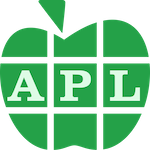

aipltest
========




This is a pilot project exploring how to collaborate with Claude.ai to develop a minimal APL testing framework that can be used for TDD (Test-Driven Development) on future projects.

It also produces Dyalog APL utility function to replicate some of the functionality of the `@` and `?` operators in the [q programming language](https://code.kx.com/q).

Indexing
--------
A foundational insight of k (the language from which q is derived) is that functions and arrays can both be considered as mappings from a domain to a range:

-   A function maps from its argument/s to a result
-   An array maps from its indices to its values

A dictionary maps from its keys to its values; an array can be thought of as a dictionary in which the array indices are the keys.

Similarly a table can be considered a matrix indexed by its row numbers and its column names.
To this we add a new data structure, the Xref, a matrix indexed by row and column names.

Programming in q awakens one to how many computations can be considered mappings from one domain to another, or even a series of such mappings.
The syntax of q permits a series of mappings to be expressed as e.g.

    h @ g @ f @ x

or, as `@` may be elided

    h g f x

and this syntax holds whether `f`, `g`, and `h` are functions, arrays or dictionaries.

The function `at` in this repository intends to do this for data structures
with the `outr` operator to provide the values for outrange indices that are implicit in q.


Products
--------
The project produces and tests:

### Simple Dyalog APL utility functions

A folder `fun` of APLF files defining functions:

	[-] at           indexes dictionary, object, table, xref or array (c.f. @ in q language)
	[x] f            interpolate string (c.f. Python)
	[x] isDict       whether ⍵ is a dictionary
	[x] isObj        whether ⍵ is an object
	[x] isString     whether ⍵ is a string
	[x] isStrings    whether ⍵ is strings
	[x] isTable      whether ⍵ is a table
	[x] isXref       whether ⍵ is an xref
	[x] j            join strings ⍺ with separator ⍵
	[ ] outr         operator: return default values for outrange indices
	[x] p            partition string ⍵ on scalar separator ⍺ (default ' ')
	[x] r            `(o n) r s`: replace characters `o` in string `s` with char `n`
	[ ] sel          syntax as `at` but result is same type as left argument

See Data Structures below and also [FUNCTIONS.md](docs/FUNCTIONS.md).

### A testing framework

Function `test/Run.aplf` executes the tests defined in `tests/*.apla` for the functions `fun/*.aplf`, records detailed results in `logs/*.log` and returns a summary (passed, failed) as a 2-item vector.

Its right argument is a list of strings naming the functions to be tested.
If the list is empty, all functions found are tested.

An optional left argument of 1 causes the result for each function to be printed in the APL session.

Script `scripts/run_tests.apls` allows Claude Code to run tests:

    ❯ ./scripts/run_tests.apls at isXref
             pass  fail
     at       212     0
     isXref    17     0
    229 0

Programming language
--------------------
The programming language is Dyalog APL version 20.

This is a challenge for a large language model. The published codebase for APL is small, and version 20 of Dyalog APL is very new and contains major new features, in particular Array Notation, `⎕VGET` and `⎕VSET`.

[Dyalog APL version 20 Language Reference Guide](https://docs.dyalog.com/20.0/language-reference-guide/)

In practice, Claude Code performs well reading and analysing APL code.
Its written APL looks more like translated Python, and requires close editing.


Terminology
-----------

We modify and extend conventional terminology for APL.

### String, strings

APL has no string datatype corresponding to a string, immutable or not. The closest corresponding datatype is a character vector.

Here we use *string* to denote a character vector and *strings* for a *list of strings*.
Example:

```apl
'quick'                ⍝ string
'quick' 'brown' 'fox'  ⍝ strings
```

### List, vector

Conventionally, an APL *vector* is a 1-dimensional array. We here limit *vector* to mean a 1-dimensional array **of uniform datatype** and use *list* for the general case.
Examples:

```apl
1 2 'three' (4 5)    ⍝ list
1 2 3                ⍝ vector
'one' 'two' 'three'  ⍝ vector
```

### Operator

Note that in APL, following Heaviside’s usage, an *operator* is a higher-level function that takes a function operand and derives a new function. Primitive infix functions such as `+`, commonly known as operators in other programming languages, in APL are known as *functions*.

Examples:
```apl
2 + 3 4  ⍝ + is the Plus function
+/2 3 4  ⍝ + is the operand of the Reduce operator; +/ derives the sum function
```

Data structures
---------------

The project functions support data structures that are not ‘first class’ in APL.
Watch Out: terms such as *object* bear meanings that resemble common usage but are particular to this project.

### Dictionary

A pair of vectors, corresponding to values and keys. The keys *should* be unique but nothing enforces this. If a dictionary has N keys and >N values, then outrange indexes for `at` return `values[N+1]`. Otherwise, outrange indexes return `⊃0⍴⊃values`.
Examples:

```apl
('animal' 'bird' 'animal' 'plant' ⋄ 'cow' 'dove' 'cat' 'rose')
('animal' 'bird' 'animal' 'plant' '[unknown]' ⋄ 'cow' 'dove' 'cat' 'rose')
```

### Object

A namespace in which all the objects are variables. Example:
```apl
(scriptPath:'path/to/scripts' ⋄ thingFlag: 1)
```

### Table

A 2-list:

1.  matrix of values
2.  corresponding column names (strings)

Example:
```apl
      (⍉['Bob' 'Ted' 'Carol' ⋄ 21 32 43 ⋄ 'blue' 'green' 'brown'] ⋄ 'name' 'age' 'eye')
┌────────────────┬──────────────┐
│┌─────┬──┬─────┐│┌────┬───┬───┐│
││Bob  │21│blue │││name│age│eye││
│├─────┼──┼─────┤│└────┴───┴───┘│
││Ted  │32│green││              │
│├─────┼──┼─────┤│              │
││Carol│43│brown││              │
│└─────┴──┴─────┘│              │
└────────────────┴──────────────┘
```

### Xref

A 3-list:

1.  matrix of values
2.  corresponding column names (strings)
3.  corresponding row names (strings)

Example:
```apl
      (⍉[21 32 43 ⋄ 'blue' 'green' 'brown'] ⋄ 'name' 'age' 'eye' ⋄  'Bob' 'Ted' 'Carol' )
┌──────────┬──────────────┬───────────────┐
│┌──┬─────┐│┌────┬───┬───┐│┌───┬───┬─────┐│
││21│blue │││name│age│eye│││Bob│Ted│Carol││
│├──┼─────┤│└────┴───┴───┘│└───┴───┴─────┘│
││32│green││              │               │
│├──┼─────┤│              │               │
││43│brown││              │               │
│└──┴─────┘│              │               │
└──────────┴──────────────┴───────────────┘
```

Project structure
-----------------

    docs/          <-- Project plans, TODOs, reports...
    fun/           <-- Dyalog APL source for functions
    scripts/       <-- Shell and Dyalog scripts
    test/          <-- Dyalog APL source for test framework
    tests/         <-- Unit tests go here
