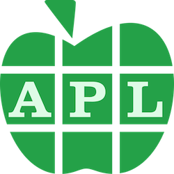

aipltest
========




Collaborate with Claude.ai to develop a minimal testing framework that can be used for TDD (Test-Driven Development) on future Dyalog APL projects.

Products
--------
The project produces and tests:

### Simple Dyalog APL utility functions

A folder `fun` of APLF files defining functions:

	at           indexes dictionary, object, table or xref (c.f. @ in q language)
	f            interpolate string (c.f. Python)
	isDict       whether ⍵ is a dictionary
	isString     whether ⍵ is a string
	isStrings    whether ⍵ is strings
	isTable      whether ⍵ is a table
	isXref       whether ⍵ is an xref
	j            join strings ⍺ with separator ⍵
	p            partition string ⍵ on scalar separator ⍺ (default ' ')
	r            `(o n) r s`: replace characters `o` in string `s` with char `n`

See Data Structures below and also [FUNCTIONS.md](FUNCTIONS.md).

### A testing framework

A folder `test` containing a file `Run.aplf` that executes the tests defined in sibling folder `tests`, records detailed results in `tests/test.log` and prints a summary (passed, failed, broke) in the APL session.

Programming language
--------------------
The programming language is Dyalog APL version 20.

This is a challenge for a large language model. The published codebase for APL is small, and version 20 of Dyalog APL is very new and contains major new features, in particular Array Notation, `⎕VGET` and `⎕VSET`.

[Dyalog APL version 20 Language Reference Guide](https://docs.dyalog.com/20.0/language-reference-guide/)

It may be possible to infer syntax from APL code in the project files.


Terminology
-----------

We modify and extend conventional terminology for APL.

### String, strings

APL has no string datatype corresponding to a string, immutable or not. The closest corresponding datatype is a character vector.

Here we use *string* to denote a character vector and *strings* for a *list of strings*.
Example:

```apl
'quick'                ⍝ string
'quick' 'brown' 'fox'  ⍝ strings
```

### List, vector

Conventionally, an APL *vector* is a 1-dimensional array. We here limit *vector* to mean a 1-dimensional array **of uniform datatype** and use *list* for the general case.
Examples:

```apl
1 2 'three' (4 5)    ⍝ list
1 2 3                ⍝ vector
'one' 'two' 'three'  ⍝ vector
```

### Operator

Note that in APL, following Heaviside’s usage, an *operator* is a higher-level function that takes a function operand and derives a new function. Primitive infix functions such as `+`, commonly known as operators in other programming languages, in APL are known as *functions*.

Examples:
```apl
2 + 3 4  ⍝ + is the Plus function
+/2 3 4  ⍝ + is the operand of the Reduce operator; +/ derives the sum function
```

Data structures
---------------

The project functions support data structures that are not ‘first class’ in APL:

### Dictionary

A pair of vectors, corresponding to values and keys. The keys *should* be unique but nothing enforces this. If a dictionary has N keys and >N values, then outrange indexes for `at` return `values[N+1]`. Otherwise, outrange indexes return `⊃0⍴⊃values`.
Examples:

```apl
('animal' 'bird' 'animal' 'plant' ⋄ 'cow' 'dove' 'cat' 'rose')
('animal' 'bird' 'animal' 'plant' '[unknown]' ⋄ 'cow' 'dove' 'cat' 'rose')
```

### Object

A namespace in which all the objects are variables. Example:
```apl
(scriptPath:'path/to/scripts' ⋄ thingFlag: 1)
```

### Table

A 2-list:

1.  matrix of values
2.  corresponding column names (strings)

Example:
```apl
      (⍉['Bob' 'Ted' 'Carol' ⋄ 21 32 43 ⋄ 'blue' 'green' 'brown'] ⋄ 'name' 'age' 'eye')
┌────────────────┬──────────────┐
│┌─────┬──┬─────┐│┌────┬───┬───┐│
││Bob  │21│blue │││name│age│eye││
│├─────┼──┼─────┤│└────┴───┴───┘│
││Ted  │32│green││              │
│├─────┼──┼─────┤│              │
││Carol│43│brown││              │
│└─────┴──┴─────┘│              │
└────────────────┴──────────────┘
```

### Xref

A 3-list:

1.  matrix of values
2.  corresponding column names (strings)
3.  corresponding row names (strings)

Example:
```apl
      (⍉[21 32 43 ⋄ 'blue' 'green' 'brown'] ⋄ 'name' 'age' 'eye' ⋄  'Bob' 'Ted' 'Carol' )
┌──────────┬──────────────┬───────────────┐
│┌──┬─────┐│┌────┬───┬───┐│┌───┬───┬─────┐│
││21│blue │││name│age│eye│││Bob│Ted│Carol││
│├──┼─────┤│└────┴───┴───┘│└───┴───┴─────┘│
││32│green││              │               │
│├──┼─────┤│              │               │
││43│brown││              │               │
│└──┴─────┘│              │               │
└──────────┴──────────────┴───────────────┘
```

Project structure
-----------------

    docs/          <-- Project plans, TODOs, reports...
    fun/           <-- Dyalog APL source for functions
    test/          <-- Dyalog APL source for test framework
    tests/         <-- Unit tests go here
